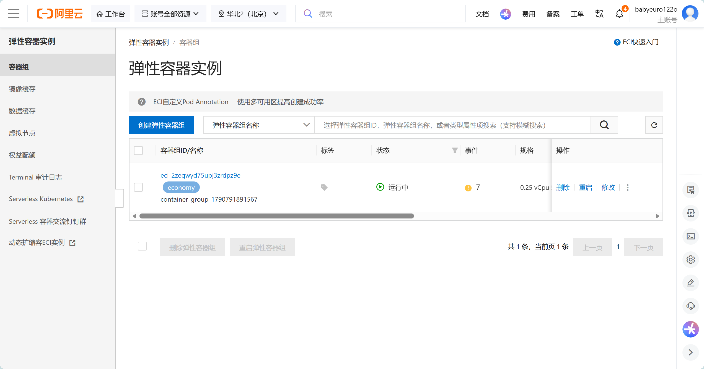
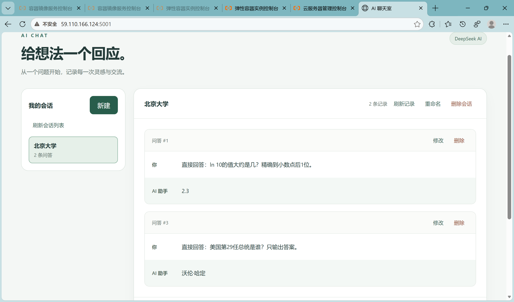

# Lab 3：姜珺尚 2300015813

本项目迁移自 `lab2/姜珺尚-2300015813/`，保留 HTML/CSS/JavaScript 前端、Flask API、多会话和聊天记录 CRUD，以及按会话历史调用 DeepSeek 的行为。未迁移密钥、真实聊天数据、虚拟环境和 Lab 2 对话轨迹。

## 运行架构

Flask 的 `/` 提供首页，`/static/` 提供前端资源，前端通过同源 `/api/conversations` 及其子路径访问会话和消息。`/api/hello` 可用于非敏感连通性检查。模型请求由后端发送，运行时读取 `DEEPSEEK_API_KEY`，前端不接触 Key。应用不自动加载 `.env`；`.env.example` 仅记录变量名和占位值。

容器由 Gunicorn 单 worker 启动 `app.py` 中的 `app`，监听 `0.0.0.0:5001`，worker 超时设为 120 秒，以容纳模型请求等待。当前实现的会话列表、ID 计数器和锁都在进程内，故保持单 worker。记录运行时写入容器的 `data/conversations.json`；本实验不配置持久化存储，容器替换或删除后不保证保留数据。

## Dockerfile

基于 `python:3.12-slim`，工作目录为 `/app`。先复制并安装依赖，再复制应用与前端。`EXPOSE 5001` 声明预期端口，实际监听由 Gunicorn 的 `--bind` 决定。`CMD` 在容器启动时运行，安装依赖和复制文件发生在镜像构建阶段。

构建按顺序执行，某步失败后不会继续后续步骤，修复后需重新触发构建。未变化的前序步骤可能命中缓存，ACR 不保证断点续跑。

`.dockerignore` 使用允许列表，仅放行 Dockerfile、忽略规则、依赖清单、`app.py` 和三份前端文件。密钥文件、数据、虚拟环境、Git 元数据、截图和对话轨迹不进入构建上下文。增加运行必需文件时需同步更新允许列表和 Dockerfile。

## 本地检查

已使用 Flask 测试客户端验证首页、CSS/JavaScript、`/api/hello`、会话和消息 CRUD、无效输入、缺少 Key 时的错误处理、JSON 写入，以及模拟模型回复下的会话上下文隔离。测试使用占位 Key 和模拟 HTTP 响应，未调用真实模型，也未读取 `.env`。Python 语法与 JavaScript 语法检查通过，个人目录 `.env` 和数据目录忽略规则已核验。

本地测试不等于容器或公网验证；后续云端验证的证据及范围见下文。

## ACR 与 ECI 实验记录

- 个人 Fork：`Frost-Maple/isse-labs`
- 个人分支：`lab3/2300015813-jiangjunshang`
- 构建规则上下文：`/lab3/2300015813-jiangjunshang/`
- Dockerfile：构建上下文内的 `Dockerfile`
- ACR 地域：华北 2（北京），学生已确认。
- ACR 私有镜像仓库：`frosty_5813/lab3-chat`。
- 完整镜像仓库地址：`crpi-jdjoxtkxqfktfsck.cn-beijing.personal.cr.aliyuncs.com/frosty_5813/lab3-chat`（按学生提供的实际地址记录）。
- 本次规则镜像标签：`lab3-c376f1d`；源码提交 `c376f1d` 已核验推送至个人 Fork。
- 构建结果：学生在控制台操作后报告构建成功；按实验要求不追加镜像标签列表核验。
- ECI：华北 2（北京），经济型，0.25 vCPU、512 MiB 内存（学生提供实际规格，截图可见 CPU 和经济型标识）。
- 实例 ID：`eci-2zegwyd75upj3zrdpz9e`；实际名称：`container-group-1790791891567`。
- 公网访问地址：`http://59.110.166.124:5001/`。
- 学生提供的容器日志显示 Gunicorn 23.0.0 监听 `0.0.0.0:5001`，sync worker 已启动。
- 运行时变量名称：`DEEPSEEK_API_KEY`，由学生在控制台填写真实值。
- 公网验证：Agent 实际 GET 首页、`/static/app.js`、`/static/style.css`、`/api/hello` 和 `/api/conversations`，全部返回 HTTP 200；首页静态资源引用、健康检查消息和会话列表结构符合预期。未通过 Agent 调用真实模型。
- 学生浏览器验证：截图可见公网 IP、5001 端口、会话和模型问答。学生报告创建、修改、删除和重命名操作均正常；静态截图不单独证明所有操作过程。
- 两张原始截图已核看，可打开且未发现凭据：`screenshots/eci-created.png`、`screenshots/public-page.png`。
- PR 与资源清理：尚未完成；提交 PR 后由学生删除本实验 ECI 并核验相关 EIP 释放情况。

本机不要求安装 Docker；镜像构建由 ACR 完成，运行由 ECI 完成。代码检查和情境思考题已完成，学生已 Push 用于构建的代码。本次真实对话已由学生导出保存到 `AGENT_TRACE.md`，Agent 保留原始内容并检查常见凭据格式，未发现命中。

## 公网排错与使用边界

首次公网访问出现连接关闭、无 HTTP 响应。容器启动日志正常；学生提供的安全组截图仅放行 TCP 22、3389 和 ICMP，没有 TCP 5001。指导学生增加入方向允许 TCP 5001 的规则后，学生可以打开页面，Agent 复测得到 HTTP 200。此记录不把最初 TCP 握手成功视为端到端应用已可用的证明。

HTTP 不加密浏览器与 ECI 之间的聊天内容。API 没有鉴权，知道地址的人可能调用后端消耗模型额度，也可能访问或修改聊天数据；这不表示浏览器能直接取得后端 Key。本项目仅用于短时教学演示，不输入敏感内容。

提交 PR 后，学生须删除本实验 ECI，核对关联 EIP 是否仍独立存在并计费，按需释放仅为本实验创建的 EIP。Agent 应核验控制台状态或脱敏文字并复测公网地址；不能仅凭网页打不开认定资源已释放。清理当前尚未完成，实验 Key 建议随后废除。

## 实验截图

